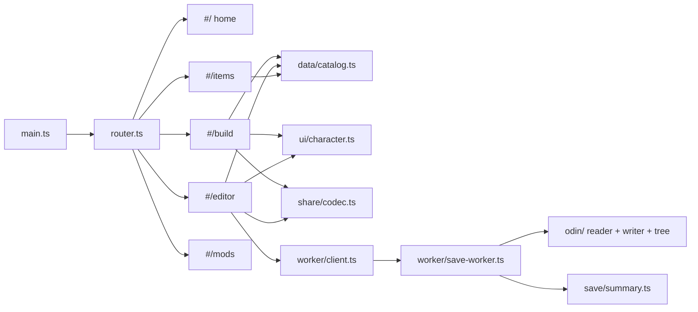
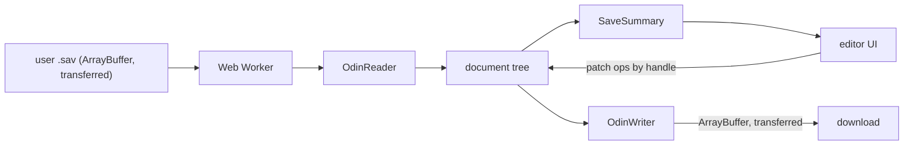

# Web app architecture

Client-side-only SPA (GitHub Pages). No framework, no backend, no telemetry.

## Routes

Hash-routed (`router.ts`); every view is a dynamic import, so a route's code
loads only when visited.

| Route | View | Purpose |
| --- | --- | --- |
| `#/` | `views/home.ts` | Landing page linking to the other views. |
| `#/items` | `views/items.ts` | Item library: search, filters, virtualized list, game tooltips. |
| `#/editor` | `views/editor.ts` | Save editor (three-file recompose flow, see below). |
| `#/build` | `views/build.ts` | Read-only viewer for shared builds (`#/build?d=<payload>`). |
| `#/mods` | `views/mods.ts` | Mods download page: the `mods-v1.0.0` release zip + install steps. |

## Modules (`web/src/`)

| Module | Responsibility |
| --- | --- |
| `router.ts` | Hash router; views are dynamic imports (code-splitting). |
| `data/coltable.ts` | Loader for column-oriented JSON tables; index-based access, O(1) joins. |
| `data/catalog.ts` | Unified item catalog (weapons/gems/useitems/sets/affixes) as flat parallel arrays. Icon paths are computed from the `ICON_SHEETS` constant — the `icons-index.json` file is never fetched at runtime (see `docs/icons.md`). `procs.json` (6.9k rows) is lazy-loaded on demand, not part of the initial catalog. |
| `ui/vlist.ts` | Windowed list: renders visible rows only, recycles DOM, rAF-batched. |
| `ui/character.ts` | Shared character rendering: item visuals, game-style tooltips built from save values (affix lines from `affix-names.json`), the paper-doll. Used by the editor and the `#/build` viewer. |
| `odin/` | OdinSerializer binary reader/writer (see `docs/sav-binary-format.md`) and the lossless document tree (`tree.ts`). |
| `worker/` | Save parse/encode runs in a Web Worker; `client.ts` is a promise RPC wrapper; ArrayBuffers are transferred, not copied. |
| `save/summary.ts` | Worker-side projection of the parsed tree into a flat `SaveSummary`; applies edits addressed by node handles (dot-joined child-index paths like `"9.2.0.5"`). |
| `share/codec.ts` | Build-share codec: binary pack → deflate → base64url (see "Share links"). |
| `views/items.ts` | Item library: search, filters, virtualized results, game-tooltip detail panel. |
| `views/editor.ts` | Character-view save editor: hero strip, paper-doll (in-game slot layout), inventory/chest grids, talents panel, click-to-edit save-value tooltips, multi-file mirroring, share, download. |
| `views/build.ts` | Decodes a share payload and renders the character view read-only. |
| `views/mods.ts` | Static download/instructions page for the BepInEx plugins. |

## Data flow

The full parsed tree never crosses the worker boundary — only the flat
`SaveSummary` projection the UI needs. Edits are sent back as small patch ops
addressed by node handles.

## The three-file recompose flow

The game keeps three files per slot and on Continue prefers
exit → auto → baseline, silently skipping invalid candidates. The editor
therefore:

1. asks for all three up front (`slot_N.sav`, `slot_N_auto.sav`,
   `slot_N_exit.sav`);
2. shows a warning banner listing whichever of the three is missing, with an
   inline "add them" picker;
3. with "apply to all N files" checked (the default), mirrors every committed
   edit into every loaded file — character/talent/money edits by **field
   name** (handles are per-file index paths and must not cross files),
   tooltip item edits by matching the equipped item by **slot + GlobalID**;
4. offers "Download all" so the trio goes back to disk together.

## Click-to-edit tooltips

The in-game tooltip rendered in the editor is editable in place: values,
elements, affix identity, socketed skills and quality are wrapped in
`data-tok` tokens. A click swaps the token for an input/select; committing
resolves the token to a worker handle (nested affix/socket handles come from
the worker's deep-leaf listing, cached per file+item) and applies a patch op.
Affix lines use the game's own templates from
`web/public/data/affix-names.json` (see `docs/affix-mapping.md`). Empty WPSK
skill sockets store `IndexName` `"0"` and are filtered out of rendering and
shares.

## Share links

The Share button packs the character header, the equipped items with rolled
affixes, and invested talents into a binary payload (varints, skill names as
skills-table row indexes, values quantized to 1/100), deflate-compresses it
and base64url-encodes it into the URL hash: `#/build?d=<payload>` — roughly
1 KB, small enough for a 2000-char Discord message. `#/build` decodes it
entirely client-side; a hash fragment never reaches any server. The codec
(`web/src/share/codec.ts`) uses `'deflate'` (zlib-wrapped), not
`'deflate-raw'`: +6 bytes, but supported by every CompressionStream
implementation. A 16-bit checksum of the skills table flags links made
against an older data version.

## Safety invariants

1. On every upload the worker first re-encodes the untouched tree and
   byte-compares against the original. If not identical, editing is disabled
   for that file and a bug report prompt is shown — we never emit a save we
   couldn't round-trip.
2. Protected fields (GameVersion, SessionId, SessionBaselineUtcTicks,
   SaveCreatedUtcTicks, SaveTransactionId, BackupKind) are never exposed as
   editable; the worker rejects sets against them.
3. Edits land in all three slot files via the recompose flow above (the game
   falls back silently across them). If Steam raises a cloud-sync conflict
   after replacing the files, choose "Upload to Steam Cloud" (see
   `docs/save-data-model.md`, invariant 15).
4. The editor does not move, add or delete inventory items yet — the grid
   renders positions read-only from the save. Any future placement edit must
   validate full item footprints (grid 15×17, page count from the save)
   because the game silently deletes overlapping or out-of-range items.

## Performance budget

- First paint < 1s on cold cache: initial JS ≤ ~30 kB gzip, data fetched
  lazily per view, icons lazy-loaded per visible row.
- Item table interactions (search/filter/sort) < 16 ms on 10k rows: typed
  column arrays, precomputed lowercase search keys, no per-row objects.
- Save parse of a 2.5 MB .sav < 250 ms in the worker: single-pass reader over
  a DataView, strings decoded lazily where possible.
