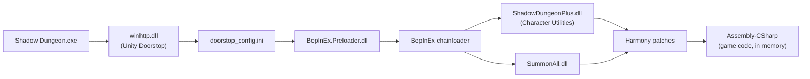

# Installing BepInEx and the plugins

Shadow Dungeon is a Unity **2019.4.39** game running the **Mono** scripting backend
(64-bit, .NET 4.x-equivalent runtime). That is the easiest possible target for
[BepInEx 5](https://github.com/BepInEx/BepInEx): no IL2CPP, no interop, plugins are
plain .NET class libraries.

Everything below was verified against a live install of **BepInEx 5.4.23.5 x64** in

```
F:\SteamLibrary\steamapps\common\Shadow Dungeon\
```

Adjust the drive/path for your own Steam library.

How the pieces load once everything is installed:



No game files are modified at any point — everything happens in the running
process.

## The short version: one zip

If you just want the mods, install BepInEx once (section 1), then download
**`ShadowDungeon-F6-Mods-1.0.0.zip`** from this repo's
[`mods-v1.0.0` release](https://github.com/dgomesbr/shadow-dungeon-tools/releases/tag/mods-v1.0.0)
and extract it into the game root. It only adds two files to
`BepInEx\plugins\`: `ShadowDungeonPlus.dll` (Max's *Character Utilities*
v1.1.0) and `SummonAll.dll` (v1.0.0). Launch the game and press **F6**.
The release page also carries the individual DLLs; the site's
[Mods page](https://dgomesbr.github.io/shadow-dungeon-tools/#/mods) shows the
zip's SHA-256 and walks through the same three steps.

Sections 2 and 3 below cover installing each plugin by hand instead.

## 1. Install BepInEx 5.4.23.5 (x64)

1. Download **`BepInEx_win_x64_5.4.23.5.zip`** from the
   [BepInEx releases page](https://github.com/BepInEx/BepInEx/releases/tag/v5.4.23.5).
   Shadow Dungeon is 64-bit — do not take the `x86` build, and do not take
   BepInEx 6 (different plugin API).
2. Extract the zip **directly into the game root** — the folder that contains
   `Shadow Dungeon.exe`. Right-click the game in Steam → *Manage* → *Browse local
   files* to get there. After extraction the root looks like this:

   ```
   Shadow Dungeon\
   ├── BepInEx\
   │   └── core\                 ← loader + Harmony (0Harmony.dll, BepInEx.dll, ...)
   ├── MonoBleedingEdge\          ← game's own Mono runtime (untouched)
   ├── Shadow Dungeon_Data\       ← game data; Managed\ holds the reference DLLs
   ├── Shadow Dungeon.exe
   ├── .doorstop_version          ← from the zip (Doorstop 4.5.0)
   ├── changelog.txt              ← from the zip
   ├── doorstop_config.ini        ← from the zip
   └── winhttp.dll                ← from the zip — the injection point
   ```

   `winhttp.dll` is *Unity Doorstop*: Windows loads it into the game process as a
   fake system DLL, and `doorstop_config.ini` points it at
   `BepInEx\core\BepInEx.Preloader.dll`, which bootstraps everything else. No game
   files are modified.

3. **Run the game once and quit.** The first run generates the rest of the layout:

   ```
   BepInEx\
   ├── LogOutput.log     ← full log of the last run
   ├── cache\
   ├── config\
   │   └── BepInEx.cfg   ← loader settings (console, log levels, ...)
   ├── core\
   ├── patchers\
   └── plugins\          ← YOUR PLUGINS GO HERE
   ```

4. **Verify.** Open `BepInEx\LogOutput.log`; a healthy first run starts with:

   ```
   [Message:   BepInEx] BepInEx 5.4.23.5 - Shadow Dungeon (...)
   [Info   :   BepInEx] Running under Unity v2019.4.39.7917901
   [Info   :   BepInEx] CLR runtime version: 4.0.30319.17020
   ...
   [Message:   BepInEx] Chainloader startup complete
   ```

   If `LogOutput.log` never appears, the doorstop did not inject — check that
   `winhttp.dll` sits next to `Shadow Dungeon.exe` (not inside a nested
   `BepInEx_win_x64_5.4.23.5\` folder from a lazy extract) and that
   `doorstop_config.ini` has `enabled = true`.

### Optional: live console

For plugin development, enable the console window in `BepInEx\config\BepInEx.cfg`:

```ini
[Logging.Console]
Enabled = true
```

You then get log output in real time instead of reading `LogOutput.log` after the
fact.

## 2. Install Character Utilities (Max's plugin)

*Character Utilities* v1.1.0 by Discord user **Max** is distributed as a single DLL
(`ShadowDungeonPlus.dll` — the assembly name differs from the plugin name) in the
[#qol-mod channel of the Shadow Dungeon Discord](https://discord.com/channels/1543586564439810138/1543599915006165002),
and redistributed with attribution in this repo's
[`mods-v1.0.0` release](https://github.com/dgomesbr/shadow-dungeon-tools/releases/tag/mods-v1.0.0).

1. Drop `ShadowDungeonPlus.dll` into `BepInEx\plugins\`.
2. Start the game. `LogOutput.log` should show:

   ```
   [Info   :   BepInEx] Loading [Character Utilities 1.1.0]
   [Info   :Character Utilities] Character Utilities loaded.
   ```

3. In game, press **F6** to open its window. Its config file appears at
   `BepInEx\config\max.characterutilities.cfg`.

Features: closest-enemy auto-aim while the game's own Auto Cast toggle is on,
gold transfer/export/import between save slots, story-progress copy between slots,
and a replayable boss portal. See [mod-mechanics.md](mod-mechanics.md) for how each
is implemented.

## 3. Install SummonAll (this repo)

Either build it from [`mods/SummonAll/`](../../mods/SummonAll/README.md)
(`dotnet build -c Release`) or take the prebuilt `SummonAll.dll` from the
[`mods-v1.0.0` release](https://github.com/dgomesbr/shadow-dungeon-tools/releases/tag/mods-v1.0.0),
then:

1. Copy `SummonAll.dll` into `BepInEx\plugins\`.
2. Start the game and check the log:

   ```
   [Info   :   BepInEx] Loading [Summon All 1.0.0]
   [Info   :Summon All] Summon All button embedded into the Character Utilities (F6) window.
   ```

   Without Character Utilities installed the second line reads
   `Character Utilities plugin not found - Summon All uses its own F6 window.` —
   both are fine.

3. In a dungeon, press **F6** and click **Summon All**. Config appears at
   `BepInEx\config\dgome.summonall.cfg` (fair-mode toggle and an optional hotkey).

## Uninstalling

- Remove a single plugin: delete its DLL from `BepInEx\plugins\`.
- Disable all modding temporarily: set `enabled = false` in `doorstop_config.ini`
  (or rename `winhttp.dll`).
- Full uninstall: delete `winhttp.dll`, `doorstop_config.ini`, `.doorstop_version`,
  `changelog.txt` and the `BepInEx\` folder. The game itself was never modified.

Plugins only affect the running game process. They can, however, modify your saves
(Character Utilities' gold/story tools write to the save slots by design) — back up
`%USERPROFILE%\AppData\LocalLow\OO Cat\Shadow Dungeon\` before experimenting.
