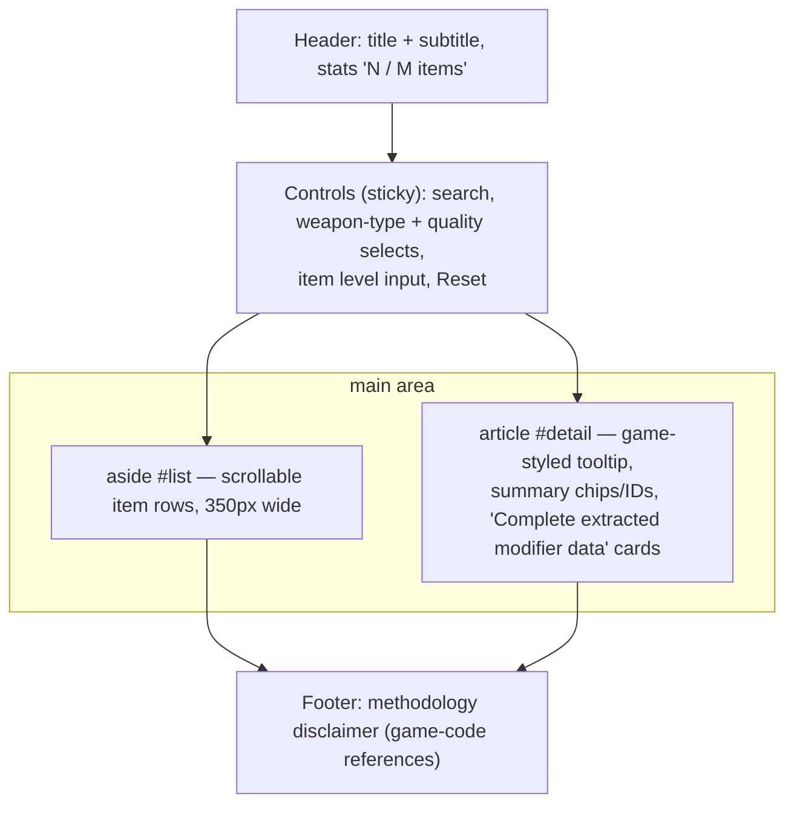

# UI Reference — Shadow Dungeon Fan Web App

Research notes on three reference UIs for our client-side item library + save editor.
Sources were fetched 2026-08-31: live HTML/JS/CSS/data files from `juister.dev` and a
2025-12-31 Wayback Machine snapshot of `d2runewizard.com/hero-editor` (the live site sits
behind a Cloudflare challenge). Everything below marked *verified* comes from actual
source/data files; items marked *inferred* are deduced from code, strings, or changelogs.

These notes predate the app. Section 4's checklist is the original v1 plan;
the shipped implementation is documented in [architecture.md](architecture.md).

---

## 1. juister.dev/shadowdungeon/items/ — "Item & Affix Database"

### Layout (verified from HTML + `style.css` + `app.js`)

Classic two-pane master–detail, full viewport height:



### Tech stack (verified)

- **Zero-framework vanilla JS.** One HTML page + `style.css` (7 KB) + `data.js` (32 MB!) +
  `app.js` (32 KB). No build system, no virtualization library, no router.
- Data is loaded as a plain `<script>` that sets `window.ITEM_DB = {"items":[...], "skillTrees":[...], "skillColorMapping":{...}}`.
  The 32 MB script blocks page load — their biggest weakness and our easiest win.
- Rendering is `innerHTML` string templates; list capped at **first 1,000 results** with a
  "First 1,000 results shown. Refine the search." row instead of virtualization.

### Item data schema (verified, from `items/data.js`)

Each item record (~1.3–3 KB of JSON) contains:

| Group | Fields |
|---|---|
| Identity | `itemName`, `globalId` (primary key), `itemType`, `className` (e.g. "Mage Items") |
| Classification | `quality` (0–8 int), `qualityName`, `weaponType` (string, e.g. "staff"), `plType` (class 0–3 or 1000=universal), `charType` (slot), `dropLevelStart` |
| Base stats | `damage`, `health`, `mana`, `element` (elemental damage budget), `elementName` |
| Grid/icon | `sizeX`, `sizeY` (inventory grid footprint!), `iconType`, `icon`, `rotateType` |
| Sockets | `maxSocketCount`, `currentSocketCount` |
| Affixes — fixed | `main[]`, `dot[]`, `skill[]`, `companion[]` |
| Affixes — random pools | `rateMain[]`, `rateDot[]`, `rateSkill[]`, `rateCompanion[]` |
| Weapon skills | `weaponSkillCount`, `skillA`–`skillF` + counts, `fixedWeaponSkills[]` |
| Special | `specialModifierIds[]`, `hasSpecialModifier`, `setIndex` |

Affix records inside those arrays: `{index, el, number, skillName, globalId, linkSkill, label, skillTreeIndex, skillTreeName, skillColor, elementName}` —
`index` is the game's stat ID, `number` the base value, `el` the element (6 = "resolves to
class talent element", 7 = "random element").

`ITEM_DB.skillTrees` (verified, 12 entries): `{index, class, name, displayName, color}` —
e.g. `{index:0, class:"Mage", name:"Fire", displayName:"Mage Fire", color:"#FF0000"}`. Used
everywhere to colorize skill names identically to the game (`GameUIManager.GetWeaponSkillColor`).

### Quality + element color coding (verified, reused on both juister pages)

```js
qualityColors = ['#ffffff','#53ff6b','#37c5ff','#b63eff','#ff50b5','#ff7200','#ffca00','#ffcee4','#e5ccab']
// 0 Normal(white) 1 green 2 blue 3 purple 4 pink 5 orange 6 gold 7 pale-pink 8 tan
damageTypeColors = ['#FF0000'/*Fire*/,'#53C5FF'/*Frost*/,'#FFF242'/*Lightning*/,'#06FF00'/*Poison*/,'#FFE6F6'/*Physical*/,'#B300FF'/*Shadow*/]
```

### Interactions (verified from `app.js`)

- **Search**: single text input, live (`input` event), case-insensitive substring over a
  concatenated haystack: name + globalId + weaponType + qualityName + className + every
  affix label + skill names + all possible DoT profile names. Simple but surprisingly deep.
- **Filters**: two `<select>`s (weapon type, quality) whose options are derived from the data
  (`new Set(db.map(...))`); an **item level** number input (1–500) that re-computes every
  level-scaled stat range live; a **Reset** button.
- **List rows**: item name colored by quality + meta line `"staff · Normal · ID 46 · 12 possible"`.
  Click selects; selection highlighted.
- **Detail panel** (the standout feature): a pixel-faithful **game tooltip reproduction**
  (dark parchment gradient, corner "rivets", quality-colored title, separator rules,
  socket line "◆ 0 – N socket slots", footer "Base form · no enhancement · no gems") with an
  embedded level input, followed by chips (type/quality/drop level/class/sockets), a skill-tree
  color legend, and card-grid "Complete extracted modifier data": Fixed main stats /
  Possible main affixes / Fixed+Possible DoT / Fixed+Possible skill effects / companion
  effects — each showing rolled **min–max ranges** for the chosen item level plus raw
  internals (`Index 1500 · base 2 · possible random roll`).
- **Roll-range math** (verified): they re-implement the game's drop formulas —
  `value * 1.066^itemLevel` for base damage/health/mana, level-bracketed low/high multipliers
  (0.9–1.3 by ilvl bands), integer-growth stats (+1 at ilvl 50, +2 at 80), elemental damage
  split into 1–4 modifiers. Placeholder lines like `<Random Main modifier>` and colored
  `<Random Frostbite modifier>` show unrolled random pools.
- **No icons at all** on the items page — it is text-only. (Icons exist only on the character page.)
- No sorting controls, no pagination, no URL state, no virtualization.

### Visual style (verified from `style.css`)

Dark slate theme, not overtly "fantasy" except the tooltip itself: body `#0e1217`,
panels `#171d24`/`#131920`/`#10151b`, borders `#303944`, text `#e8edf2`, muted `#94a0ad`;
system-ui font at 14px; the game tooltip switches to Arial 16px, centered, with
`linear-gradient(180deg,#0e0d12,#111015 68%,#0d0c11)` background, double borders, and
absolute-positioned rivet dots. Quality color arrives via CSS var `--quality`.

---

## 2. juister.dev/shadowdungeon/character/ — "Character Build Inspector"

(Version 6.6.0 per meta tag. `juister.dev/shadowdungeon/` root returns 403 — the two apps
are standalone pages, no shared shell.)

### Layout (verified from HTML)

Single centered column ("app-shell"):

1. **Header** — eyebrow "LOCAL SAVE INSPECTOR", title, and the privacy pledge right in the
   subhead: *"The save is read in this browser. It is never uploaded."* Right side: language
   `<select>` (24 languages) + "Show roll ranges" checkbox.
2. **Upload card** — drag-and-drop zone, `tabindex=0 role=button`, hidden
   `<input type=file accept=".json,.sav,application/json">`, hint text
   `slot_*.json / slot_*.sav`.
3. **Build actions** — "Share Build" button + live status line (`aria-live=polite`), then a
   hidden share-link readonly input row.
4. **Character panel** — summary (name, class, level, "Equipped 0 / 10") + a
   **gear workspace**: `#equipmentGrid` (slot cards) on the left, a sticky
   `#tooltipMount` "tooltip stage" on the right.
5. **Skill trees panel** — point counters (Total / Class trees / Divine Favor / Available),
   class tabs, tree tabs, and a scrollable tree canvas.
6. **`<details>` "Parser diagnostics"** — pretty-printed JSON: app version, detected format
   (JSON vs Odin binary), root keys, player keys, equipped count, DB match count, talent totals.
   Brilliant low-cost debugging aid; copy this.

### Data files loaded (verified — all classic `<script src>` setting `window.*` globals)

| File | Size | Global | Contents |
|---|---|---|---|
| `data/items-data.js` | 13.2 MB | `WP_ITEM_DATABASE` (array) | Same schema as items page but leaner: adds `iconPath`, `soundDrop`, `soundUse`, `rotateType`; drops the pre-resolved `label`/`qualityName` strings |
| `data/localization-data.js` | 1.9 KB | `WP_LOCALIZATION` | 24-language manifest, `{id,label,file}` per locale |
| `data/locales/English.js` | 396 KB | `WP_LOCALE_TABLES.English` | Full game string table keyed `"Sheet.key"` (e.g. `"Start_FY.start_btn"`), loaded lazily per language |
| `data/talent-data.js` | 556 KB | `WP_TALENT_DATABASE` | `xiData[]`: per-tree dictionaries of talent nodes `{B_Number, B_Type, Level_Max, Price, UnLock_Point, Xi, damageType, icon:{name:"SK00_26"}, ...}` |
| `data/skill-tree-layout.js` | 153 KB | `WP_SKILL_TREE_LAYOUT` | **Exact node coordinates scraped from the Unity scene** (`worldX/worldY/width/height/path` into the UICanvas) so trees render with in-game geometry |
| `data/set-data.js` | 28 KB | `WP_SET_DATABASE` | Set bonuses: `{setId, setName, lit:[3 bonus stats], buff...}` |
| `data/spc-data.js` | 1.1 MB | `WP_SPC_DATABASE` | Special-modifier metadata by ID |
| `data/runtime-settings.js` | 100 B | `WP_RUNTIME_SETTINGS` | `{RandomCount:0.005, MultiLevelA:1.066, MultiLevelB:1.03, RDEL:0.3}` — the game's scaling constants |
| `data/affix-spec.js` | 19 KB | `WP_AFFIX_SPEC` | Maps stat `index` → internal key (`{"1":{source:"main",key:"HealthMax"}, "17":{key:"GeDang"}...}`) for localization lookup |
| `odin-binary.js` | 16 KB | `OdinBinary` | Full **OdinSerializer binary format reader** (see below) |
| `app.3199e7456ff8.js` | 97 KB | — | All UI logic, vanilla JS IIFE, content-hashed filename |

### Item icons (verified)

**Individual PNG files, not a spritesheet.** Each DB record carries
`iconPath: "icons/items/00_0046.png"` — naming is `{iconType:02d}_{icon:04d}.png` under
`character/icons/items/`. Probed `00_0046.png`: HTTP 200, `image/png`, ~5 KB. The equipment
slot card renders `` with a
unicode glyph fallback (†, ◈, ⌂, ♜ …) per slot. Talent icons follow a similar per-file
pattern derived from sprite names (`SK00_26` etc.).

### Save parsing pipeline (verified from `app.js`)

1. `file.arrayBuffer()` → try UTF-8 decode → `JSON.parse` (also retries on the substring
   between first `{` and last `}` — tolerates BOM/garbage wrappers).
2. If not JSON: `OdinBinary.isOdinBinary(bytes)` sniffs the first byte for Odin node markers,
   then `OdinBinary.decode(bytes)` — a complete port of OdinSerializer's binary reader
   (all 0x00–0x33 entry types, little-endian primitives, .NET GUID byte order, type table,
   internal reference resolution, `_odinDiagnostics` on the result).
3. `findSaveRoot` walks up to 4 levels through `SaveData/Data/Value` wrappers until it finds
   an object with `InventoryData` or `PlayerData`.
4. Normalizers (`normalizeItem`, `normalizeStat`, `normalizeWeaponSkill`) use a
   `pick(raw,'GlobalID','globalId')`-style multi-key accessor so both PascalCase (game JSON)
   and camelCase variants parse. Item instance fields read from the save:
   `GlobalID, ItemName, Quality, Level, PLtype, WeaponType, CharType, IconPath, EnhanceTime,
   JHEL_Count, JH_Count, Price, DropScene, MJ_Level, BaseValueMultiplier, Damage, Health, Mana,
   Fire/Frozen/Thunder/Poison/Physics/Shadow, Main[], DOT[], SK[], CP[], Set_Index,
   SetRuntimeData, WPSK[], WP_SkillCount, Aocao[] (sockets), AocaoCount, MaxAocaoCount, SPC[]`.
   Each instance is joined to its template via `itemById.get(globalId)` for fallback values.
5. Character fields: `PlayerData.PlayerName/PlayerType/Level/EquippedSetCounts`,
   `InventoryData.Equipments` (10 slots: weapon, offhand, head, body, hands, feet, amulet,
   talisman, ring1, ring2 — `charType` 0–9).

### Interactions (verified)

- Slot cards select on **click, mouseenter, and focus** — hover-to-preview like a game.
- Selected item renders a full in-game tooltip: quality-colored name with `+enhance` suffixes,
  class/level row, base stats, elemental lines, DoT lines, **set section with per-piece
  activation** (2/3/4-piece lines dimmed if not enough pieces equipped), skill/companion
  section, special/weapon-skill bullet list, socket circles with gem names, price + "Equipped"
  footer.
- "Show roll ranges" toggle annotates each stat with its possible min–max roll for the item's
  level (`multiplierRange` uses ilvl brackets and `DropScene` overrides).
- Skill-tree browser: class tabs → 3 trees per class + shared "Divine Favor" tree; nodes
  positioned from the exported Unity coordinates, SVG connector lines colored by
  allocated/unallocated, per-node level text, unlock logic reimplemented (`UnLock_Point`
  thresholds, Divine Favor father/lane requirements, level-100 gate).
- **Share Build**: payload `{v:2, c:classType, l:level, e:[compact items], t:{talents}}` →
  JSON → gzip via `CompressionStream` → base64url with `g.`/`j.` prefix → `?data=` query param
  on the canonical URL; auto-copies to clipboard. Loading a shared link reverses it
  (2 MB decompressed cap). Compact item encoding trims trailing zero fields from arrays.
- Language switch lazy-loads `data/locales/<id>.js` and re-renders everything through the
  real game string table (`gameLoc('Item_FY', name, fallback)`).

### Visual style

Same dark slate family as the items page; cyan accent `#8feaf0` on the share button;
eyebrow/kicker labels in letter-spaced uppercase; quality color exposed as `--quality`
CSS var on each slot card. Amusing implementation note: the Share button is defended by a
`MutationObserver` + inline `!important` styles against ad-blockers hiding it.

---

## 3. d2runewizard.com/hero-editor — Hero Editor for Diablo 2: Resurrected

Live site is behind a Cloudflare interactive challenge; analysis is from the
2025-12-31 Wayback snapshot (pre-load landing state), its Next.js chunks, and the embedded
d2s parser library. Post-load UI details that could not be captured are marked *inferred*.

### Tech stack (verified)

- **Next.js (App Router)** — route group `app/(aside-hero-editor)/hero-editor/`, ~45 code-split
  chunks, error boundary route, dark/light mode toggle, login (Google/Battle.net/Overwolf).
- The save engine is a bundled **client-side `d2s` library** (structure matches the
  open-source `dschu012/d2s`): `BitReader`/`BitWriter`, `readCharItems / readCorpseItems /
  readMercItems / readGolemItems` (+ matching `write*`), quests (`quests_normal/...` 96-byte
  blocks), waypoints, status bit flags (`hardcore`, `died`, `expansion`, `ladder`),
  `fixHeader` (recomputes size + checksum on write), and **shared stash `.d2i`** support
  (magic `0xaa55aa55`). Item affixes are decoded against bundled game .txt tables
  (`str name`, `Equiv1/2`, string.txt/expansionstring.txt/patchstring.txt) so property
  descriptions are human-readable. Quality tiers: Low/Normal/Superior/Magic/Set/Rare/
  Unique/Crafted. All parsing AND regeneration happens in the browser.

### Page layout (verified from snapshot)

- Global site chrome: top nav (Tools / Calculators / Simulators / Explore dropdowns), login +
  streak gamification, light-mode toggle, "Support Us".
- Hero editor landing: title + date, then **two entry tabs: "Load Existing Character" /
  "Create New Character"**.
- Load tab copy: "Select the character save file (.d2s)", pointing at the
  `Saved Games\Diablo II Resurrected` folder in the user profile, + explanation that a save
  consists of .d2s/.map/.key/.ctl and you overwrite the .d2s. "This tool allows you to load,
  edit, and generate .d2s files. It also supports loading shared stash files (.d2i)."
- Below the fold: **"What's new" changelog**, **"Known issues"** ("Some items ... do not have
  a visual yet", "Save files from mods are not guaranteed to work!"), help links
  (forum/Discord), and rotating **"Hero Editor Tips"**.

### Editing workflow (verified where sourced, otherwise inferred)

1. **Entry**: upload a `.d2s` (file picker) or start "Create New Character" from scratch —
   both paths converge on the same editor. (verified)
2. **Sections** (verified from library + tips; visual arrangement inferred): a **general
   section** with character-level fields — name, class, level, difficulty progression
   (Hatred/Terror/Destruction act tracking appears in the layout chunk), and **status
   checkboxes** — one tip says you *"revive a dead hardcore character by unchecking the
   'died' attribute in the general section."* Attributes (str/dex/vit/energy, life/mana,
   gold), skills, quests, waypoints, mercenary, corpse, and iron-golem data are all
   round-tripped by the engine.
3. **Inventory**: rendered as in-game-style **grids** (inventory / stash / cube / paper-doll
   equipment slots) with item sprites (known issue admits some items "do not have a visual
   yet"), for character, corpse, mercenary and shared stash. (inferred from engine +
   known-issues wording)
4. **Add item flow** (verified from changelog): a dedicated "Add" screen with
   *"a more advanced search"* that lets you *"add multiple items in varying quantities in
   one action"* — i.e. batch-add from the full item catalog (uniques, sets, runes, gems,
   bases, runewords).
5. **Edit item flow** (verified from changelog + tips): click an item → **item detail
   editor**: change quality/base ("You can change a set or unique item's base item to any
   other weapon or armor base"), add attributes chosen via *"the human-readable property
   description"* (any stat ID, including exotic ones like `item_reanimate`), set sockets
   beyond the legal max, enhanced damage on clean items, **"extract runes and gems from
   items without destroying them"**.
6. **Validation**: soft, not strict — the tool deliberately allows illegal-but-loadable
   states (over-socketing, revived hardcore); hard failures are limited to unsupported
   modded content. Errors surface via a route-level error boundary. (verified strings +
   inferred behavior)
7. **Download**: "generate .d2s" — the writer re-serializes every section and `fixHeader`
   recomputes the byte size + checksum before handing the file back as a download; the user
   overwrites the file in their save folder. (engine verified; button placement inferred)

### Visual style

Dark theme by default with a light-mode toggle; D2-flavored styling with item-quality
coloring and game sprites in grids; content-site chrome around the tool (nav, ads/support,
changelog) rather than an app-only shell. (partly inferred)

---

## 4. v1 Feature Checklist for OUR app

Synthesized from all three. Targets the `web/` app in this repo; data can be produced by our
existing extraction pipeline (juister's file layout proves the whole approach works — but we
should fix their mistakes: JSON over 32 MB globals-in-`<script>`, virtualization over
1,000-row caps).

### Shared foundation

- [ ] Static JSON data files split by concern (items, sets, talents, affix-spec, locale
      tables, runtime constants) — versioned filenames or `?v=` for cache busting; lazy-load
      locales. Keep juister's field names where practical so community tooling/docs transfer.
- [ ] Item icons as individual PNGs named `{iconType:02d}_{icon:04d}.png` (matches game
      atlas indices; ~5 KB each). Consider a build step that also emits a spritesheet +
      JSON atlas for the library list view.
- [ ] Quality palette (indices 0–8): `#ffffff #53ff6b #37c5ff #b63eff #ff50b5 #ff7200 #ffca00 #ffcee4 #e5ccab`;
      element palette Fire `#FF0000`, Frost `#53C5FF`, Lightning `#FFF242`, Poison `#06FF00`,
      Physical `#FFE6F6`, Shadow `#B300FF`; 12 skill-tree colors from `skillTrees`.
- [ ] Game-accurate tooltip component (single implementation reused by library, editor, and
      share views): quality-colored title, separators, affix lines colored by skill tree,
      set-piece activation dimming, socket rows, roll-range annotations toggle.
- [ ] Dark fantasy theme: near-black blue-grey surfaces (`#0e1217`/`#171d24` family), muted
      borders, uppercase letter-spaced kickers, quality color as CSS custom property.

### Item library page

- [ ] Search-as-you-type over name, ID, type, quality, class, affix labels, skill names
      (juister proves substring-over-haystack is enough for v1).
- [ ] Filters: slot/charType, weapon type, **class (plType)**, quality, **set** (juister lacks
      class & set filters — cheap wins), plus item-level input that live-rescales all ranges.
- [ ] Virtualized list (no 1,000-row cap): icon + quality-colored name + meta line
      (type · quality · ID · affix count).
- [ ] Sorting (name, drop level, quality, damage/health/mana) — none of the references have it.
- [ ] Detail panel: game tooltip preview + chips + skill-tree legend + full modifier tables
      with min–max rolls at chosen ilvl and raw internals (index/base) behind a toggle.
- [ ] URL state for search/filters/selected item (juister has none; enables deep links).

### Save editor page

- [ ] Drag-and-drop + file-picker upload for `slot_*.json` / `slot_*.sav`; parse JSON first,
      fall back to OdinSerializer binary sniffing; tolerate BOM/wrapper nesting
      (`findSaveRoot` pattern). Privacy pledge in the header: parsed locally, never uploaded.
- [ ] Two entry paths like d2runewizard: **Load existing save** / (later) **Create new character**.
- [ ] Character stats panel (general section): name, class, level, gold/currencies, unlock
      flags — editable fields, d2rw-style "dangerous but allowed" checkboxes.
- [ ] Equipment paper-doll: the 10 slots (weapon, offhand, head, body, hands, feet, amulet,
      talisman, ring1, ring2) as cards with item icon, quality border, +enhance suffix;
      hover/focus/click selects into the shared tooltip stage.
- [ ] Inventory grid pages: spatial grid using `sizeX`/`sizeY` footprints from the item DB
      (bag pages, stash tabs as the save exposes them), drag to move (v1: click-to-select,
      buttons to move/delete).
- [ ] Item editor form: change level, quality, enhancement, sockets + gems, and add/edit
      affixes picked by **human-readable label** (affix-spec + locale table), with legal roll
      ranges shown but not enforced (warn on out-of-range instead of blocking).
- [ ] Add-item flow: searchable catalog picker (reuses library components), batch quantities.
- [ ] Talent/skill-tree viewer (read-only v1, editable v1.1): point counters, class tabs,
      exact-layout node canvas with connector lines.
- [ ] Download flow: re-serialize to the exact on-disk format (JSON or Odin binary — we need
      the writer juister never built), preserve unknown fields untouched, name the file
      `slot_N.*`, and show a diff/summary of edits before download.
- [ ] Parser diagnostics `<details>` panel (copy juister verbatim — trivial and invaluable).
- [ ] Shareable build links: gzip(JSON) → base64url in `?data=`, `g.`/`j.` prefix scheme.

### Explicit non-goals for v1

Accounts/login, server-side anything, mercenary-equivalent editing if the save has none,
mod-save guarantees (state it in Known Issues like d2rw does).

## 5. Differentiators — what we can do better

1. **Editing, not just viewing.** juister's inspector is read-only; we combine its
   game-faithful presentation with d2runewizard's full round-trip (load → edit → regenerate)
   for Shadow Dungeon saves — nobody offers that today.
2. **All-client-side privacy, stated loudly.** Match juister's "never uploaded" pledge and
   d2rw's local processing; we can additionally work fully offline (PWA) since we have no
   ads/login/server dependencies.
3. **Performance.** juister ships a blocking 32 MB `data.js` and caps lists at 1,000 rows;
   d2rw ships a heavy multi-chunk site shell. We ship split, lazy-fetched JSON (+ optional
   compression), virtualized lists, and icons via spritesheet — sub-second first paint.
4. **Safety net d2rw lacks.** Preserve-unknown-bytes round-tripping, automatic backup copy of
   the original file, an edit summary/diff before download, and non-blocking legality warnings
   (out-of-range rolls flagged, never silently clamped).
5. **Deep links & URL state** for both library filters and shared builds; juister's share
   links exist but its library has zero URL state, and d2rw's editor state isn't shareable.
6. **Integrated ecosystem.** Same data files power the library, the editor's add-item
   catalog, and (later) build planning — one schema, one tooltip renderer, consistent colors;
   the references are three disconnected tools.
7. **Sorting + richer filtering** (class, set, slot, sortable columns) — absent from juister.

---

### Appendix: raw reference facts worth keeping handy

- juister items page files: `items/{index.html, style.css (7 KB), data.js (32.4 MB), app.js (32 KB)}`.
- juister character page files: see table in §2; app version 6.6.0; total data payload ≈ 15.6 MB + app 97 KB.
- Character DB record count: 13.2 MB at ~1.3 KB/record ⇒ roughly 10k item templates (order of magnitude).
- Save slot filenames: `slot_*.json` / `slot_*.sav`; binary saves are OdinSerializer binary
  format (first byte 0x01–0x04 node marker), fields PascalCase (`PlayerData`, `InventoryData.Equipments`,
  `Aocao` = sockets, `EnhanceTime`, `JHEL_Count`, `MJ_Level`...).
- Game scaling constants: `MultiLevelA = 1.066` (per-level base-stat growth), `MultiLevelB = 1.03`,
  `RandomCount = 0.005`, `RDEL = 0.3`.
- d2runewizard save engine sections: header/status bits, quests (per difficulty), waypoints,
  attributes, skills, char items, corpse items, merc items, golem item, shared stash (.d2i,
  magic `0xaa55aa55`), checksum fix on write.
